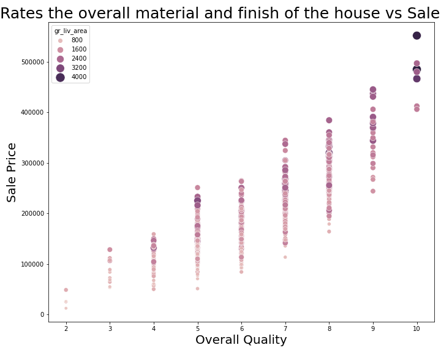
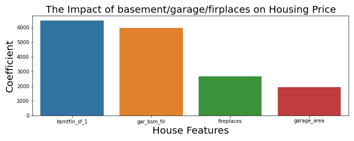
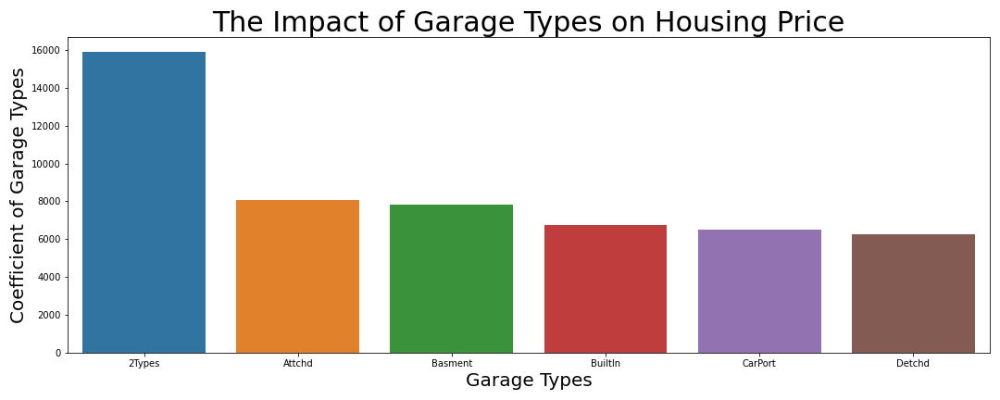
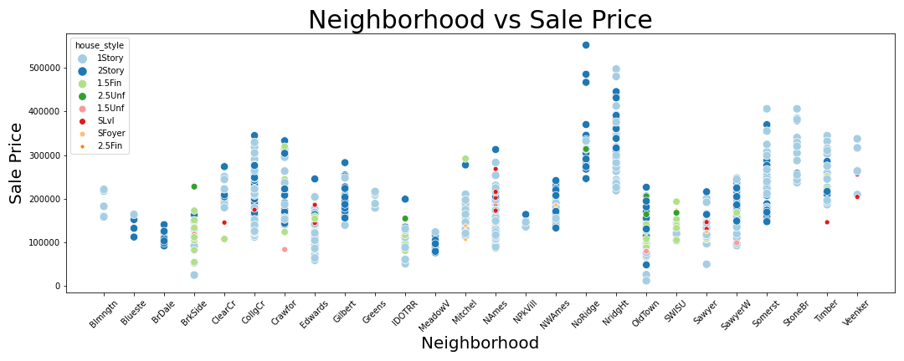
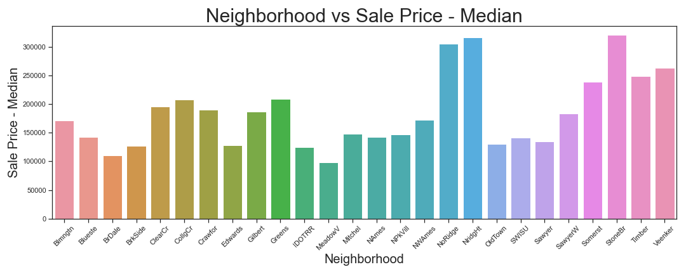
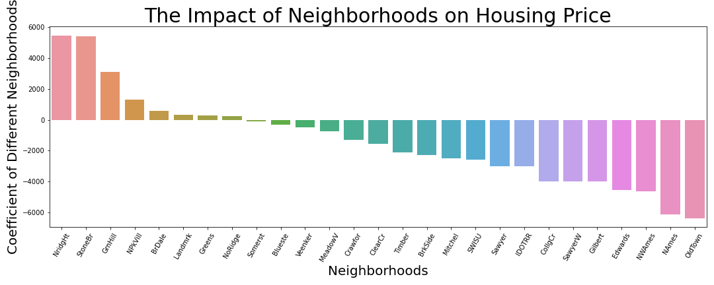

# Project 2 - Ames Housing Data and Kaggle Challenge

Letty Wu

---

## Background

Ames is a city in Story City, Iowa, located approximately 30 miles (48 km) north of Des Moines in central Iowa. It is best known as the home of Iowa State University (ISU), with leading agriculture, design, engineering, and veterinary medicine colleges. A United States Department of Energy national laboratory, Ames Laboratory, is located on the ISU campus.[source](https://en.wikipedia.org/wiki/Ames,_Iowa)

---

## Problem Statement

Real estate investment is one of the top investments that people would consider bringing in extra income, differently from owner occupied property, investors have to consider a lot more factors, which in this project, I will mainly focus on the neighborhoods in Ames city, Iowa. Which neighborhoods you should absolutely consider when you are looking for an investment property?  

---

## Data Dictionary

The [Data set](http://jse.amstat.org/v19n3/decock/DataDocumentation.txt) is from Ames Assessor’s Office includes individual residential properties sold in Ames, IA from 2006 to 2010, it contains 2930 observations and 82 variables, but for modeling purpose, I narrowed the variables down to 38. 

|#|Columns name|# of nulls|Data Type|Description|
|---|---|---|---|---|
|1|**ms_subclass**|x|Nominal|Identifies the type of dwelling involved in the sale.|
|2|**lot_area**|x|Continuous|Lot size in square feet|
|3|**land_contour**|x|Nominal|Flatness of the property|
|4|**electrical**|x|Ordinal|Electrical system|
|5|**lot_config**|x|Nominal|Lot configuration|
|6|**neighborhood**|x|Nominal|Physical locations within Ames city limits|
|7|**bldg_type**|x|Nominal|Type of dwelling|
|8|**house_style**|x|Nominal|Style of dwelling|
|9|**overall_qual**|x|Ordinal|Rates the overall material and finish of the house|
|10|**year_remod_add**|x|Discrete|Remodel date (same as construction date if no remodeling or additions)|
|11|**roof_style**|x|Nominal|Type of roof|
|12|**roof_matl**|x|Nominal|Roof material|
|13|**exterior_1st**|x|Nominal|Exterior covering on house|
|14|**exter_qual**|x|Ordinal|Evaluates the quality of the material on the exterior|
|15|**mas_vnr_type**|22|Nominal|Masonry veneer type|
|16|**mas_vnr_area**|22|Continuous|Masonry veneer area in square feet|
|17|**foundation**|x|Nominal|Type of foundation|
|18|**bsmt_qual**|55|Ordinal|Evaluates the height of the basement|
|19|**bsmtfin_type_1**|55|Ordinal|Rating of basement finished area|
|20|**bsmtfin_sf_1**|1|Continuous|Type 1 finished square feet|
|21|**total_bsmt_sf**|1|Continuous|Total square feet of basement area|
|22|**heating**|x|Nominal|Type of heating|
|23|**central_air**|x|Nominal|Central air conditioning|
|24|**gr_liv_area**|x|Continuous|Above grade (ground) living area square feet|
|25|**full_bath**|x|Discrete|Full bathrooms above grade|
|26|**half_bath**|x|Discrete|Half baths above grade|
|27|**bedroom_abvgr**|x|Discrete|Bedrooms above grade (does NOT include basement bedrooms)|
|28|**totrms_abvgrd**|x|Discrete|Total rooms above grade (does not include bathrooms)|
|29|**fireplaces**|x|Discrete|Number of fireplaces|
|30|**garage_type**|113|Nominal|Garage location|
|31|**garage_cars**|1|Discrete|Size of garage in car capacity|
|32|**garage_area**|1|Continuous|Size of garage in square feet|
|33|**mo_sold**|x|Discrete|Month Sold (MM)|
|34|**yr_sold**|x|Discrete|Year Sold (YYYY)|
|35|**saleprice**|x|Continuous|Type of sale|

---

## Data Observations

    

#### The better overall quality the house has, with bigger size, the higher the sale price is

    

#### Finished basement has really big positive impact on housing price

    

#### Houses with more than one types of garage are more expensive compare to all others

      

#### Northridge and Northridge Heights have the highest housing prices, Brookside and Old Town have the lowest

        

#### But Stone Brook actually has the highest median sale price among all the areas

---    
    
## Conclusions and Recommendations     
    

    

- Considering buying house in following neighborhoods
    - Stone Brook
    - Northridge Heights
    - Green Hills
    - Northpark Villa
    - Northridge
    - Briardale
    - Greens
    - Landmark
    - Bluestem

- Considering buying house with more than one type of garages
- Considering buying house with finished basements

